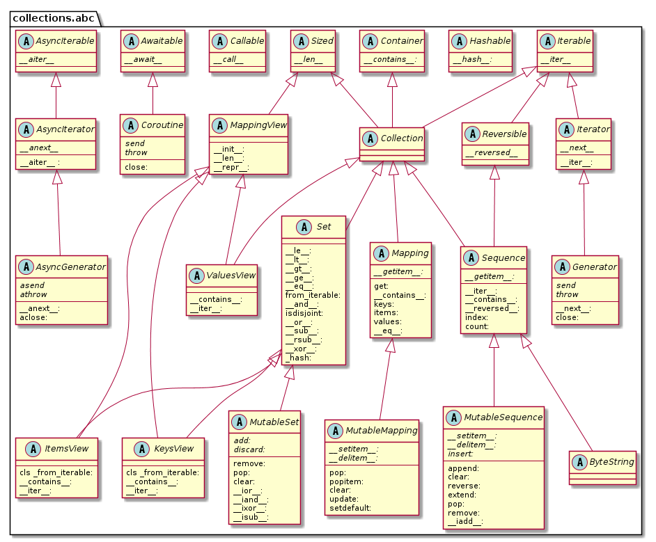
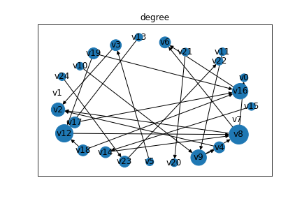
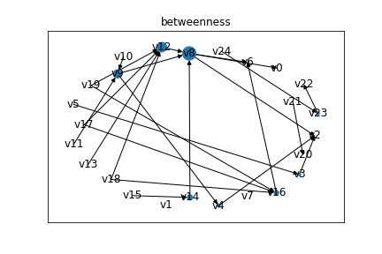
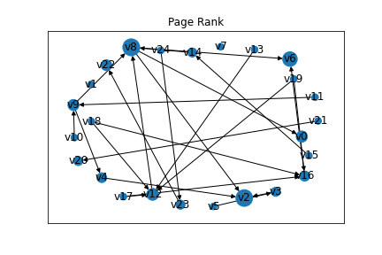

# Package Analysis through Network Analysis Methods

[](https://www.python.org/downloads/release/python-360/)

[](https://hub.docker.com/r/hayata/pkg-analysis)

## What's this?

The purpose of this repository is to apply some network analysis methods, which is precisely based on graph theory, to sample data. This repository **does not** have 

- Academic or technical deep explanation
- Meaningful background (I just played with data)
- Insightful results

## Setup

### Assumptions

```bash 
$ pyenv --version
pyenv 1.2.18

$ python --version 
Python 3.7.6
```


### Installation

**local**

```bash
$ python -m venv .venv 
$ source .venv/bin/activate
$ pip install -r requirements.txt
$ jupyter lab 
```

**docker**

```bash 
$ docker build -t <image-name> .
$ docker run -it -p 8888:8888 <image-name> 

# If you want
# $ docker run -d --rm -p 8080:8080 plantuml/plantuml-server:jetty
```

Then, open your browser by [localhost:8888](http://localhost:8888). Probably, JupyterLab requires you to input access token (it's already outputted on console.) 


## Data
The data was extracted from [collection.abc](https://docs.python.org/ja/3/library/collections.abc.html). 

### UML Diagram 
Only on a diagram, I wrote down some functions to understand what functions are declared as an abstract method, and what functions are added on some classes. Source is [here](./uml/python-abc-collections.pu).

**Notes**

- Separated `@abstractmethod` and usual ones by horizontal line
- Avoided to write output type (I'm not confident)
- `cls` means `@classmethod`




### CSV
Data is following [Gremlin style](https://docs.aws.amazon.com/ja_jp/neptune/latest/userguide/bulk-load-tutorial-format-gremlin.html) because I'm aiming to insert this data into AWS Neptune. From my perspective, I have to deal with some Graph DB in real business situations. For further improvements, I just chose to store data based on Gremlin style.

```bash 
$ head -n 5 data/vetices.csv
~id,name:String
v0,"Container"
v1,"Hashable"
v2,"Iterable"
v3,"Iterator"

$ head -n 5 data/edges.csv
~id,~from,~to,~label
e0,v3,v2,extends
e1,v4,v2,extends
e2,v5,v3,extends
e3,v8,v6,extends
```

If your interest to AWS Neptune -> [here](https://aws.amazon.com/jp/neptune/)

## Analysis 

Notebook: [here](./network_analysis.ipynb)

### [Degree Centrality](https://networkx.github.io/documentation/stable/reference/algorithms/generated/networkx.algorithms.centrality.degree_centrality.html#networkx.algorithms.centrality.degree_centrality)

<a href="https://www.codecogs.com/eqnedit.php?latex=C(v)&space;=&space;\frac{deg(v)}{n-1}" target="_blank"></a>



### [Betweenness Centrality](https://networkx.github.io/documentation/stable/reference/algorithms/generated/networkx.algorithms.centrality.betweenness_centrality.html#networkx.algorithms.centrality.betweenness_centrality)

<a href="https://www.codecogs.com/eqnedit.php?latex=C_B(v)&space;=&space;\sum_{s,&space;t&space;\in&space;V}&space;\frac{\sigma(s,&space;t|&space;v)}{\sigma(s,&space;t)}" target="_blank"></a>



### [Page Rank](https://networkx.github.io/documentation/stable/reference/algorithms/generated/networkx.algorithms.link_analysis.pagerank_alg.pagerank_numpy.html#networkx.algorithms.link_analysis.pagerank_alg.pagerank_numpy)

<a href="https://www.codecogs.com/eqnedit.php?latex=R(u)&space;=&space;c&space;\sum_{v&space;\in&space;B_u}&space;\frac{R(v)}{N_v}" target="_blank"></a>



## Thanks

These are very helpful to do this activities. Arigatou!

**Tools**
- [Visual Studio Code](https://github.com/microsoft/vscode)
- [PlantUML](https://github.com/plantuml/plantuml-server)
- [JupyterLab](https://github.com/jupyterlab/jupyterlab)
- [LaTeX Equation (CodeCogs)](https://www.codecogs.com/latex/eqneditor.php)

**Extensions**
- [VSCode PlantUML](https://github.com/qjebbs/vscode-plantuml)

**Libraries**
- [Networkx](https://github.com/networkx/networkx)

## References
**UML**
- [PlantUML Overview](https://plantuml.com/ja/)
- [Class Diagram](http://www.agilemodeling.com/style/classDiagram.htm)
- [UML Tutorial](https://sparxsystems.com/resources/tutorials/uml2/index.html)
- [UMLの爆速プレビュー環境をVisual Studio Code + PlantUML Server on Dockerで簡単に構築する](https://dev.classmethod.jp/articles/plantuml-server-on-docker/)

**Python**
- [Python](https://github.com/python/cpython)
- [collections.abc (Python)](https://docs.python.org/ja/3/library/collections.abc.html)
- [typing (Python)](https://docs.python.org/ja/3/library/typing.html)
- [Pythonの組み込みデータ型の分類表（ミュータブル等）
](https://gammasoft.jp/blog/python-built-in-types/)

**Network Analysis & Graph Theory**
- [Gremlin Load Data Format](https://docs.aws.amazon.com/neptune/latest/userguide/bulk-load-tutorial-format-gremlin.html)
- [Networkx Documentation](https://networkx.github.io/documentation/stable/index.html)
- [PageRank (Wikipedia)](https://en.wikipedia.org/wiki/PageRank#Python)
- [Page, Lawrence; Brin, Sergey; Motwani, Rajeev and Winograd, Terry, The PageRank citation ranking: Bringing order to the Web. 1999](http://dbpubs.stanford.edu:8090/pub/showDoc.Fulltext?lang=en&doc=1999-66&format=pdf)
- [グラフ理論](https://amzn.to/36p1qfm)
- [グラフ理論入門 基本とアルゴリズム](https://amzn.to/36pOZQg)
- [つながりのビックデータ解析 人間関係ネットワークの科学と活用](https://www.nii.ac.jp/userdata/shimin/documents/H28/160622_1stlec.pdf)
